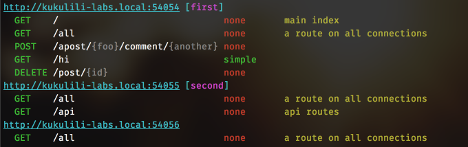

# blipp 

`blipp` is a simple hapi plugin to display the routes table to console at
startup. It organizes the display per connection so if you have multiple
connections you can easily ensure that you've done your routing table
correctly. This can be difficult to see otherwise.


## Usage (Hapi v17)

Register like any other plugin

See [examples](examples/) for examples

## Options

The following options are available:

* `showAuth`: Shows any hapi authentication scheme using _server.auth.strategy_. Default: false
* `showScope`: Shows route access rules using _route.options.auth.access.scope_. Default: false
* `showStart`: Shows route information during startup of server. Default: true


The module also registers the _'info()'_  and _'text()'_ API methods:
```javascript
console.log(server.plugins.blipp.info());
console.log(server.plugins.blipp.text());
var json = JSON.stringify(server.plugins.blipp.info());
```


With showAuth:



## Versions

* 1.x = hapi 7.x
* 2.x = hapi 8.x
* 3.x = hapi 17.x
* 4.x = hapi 18.x